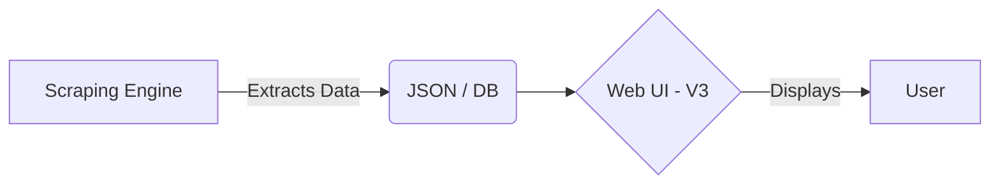
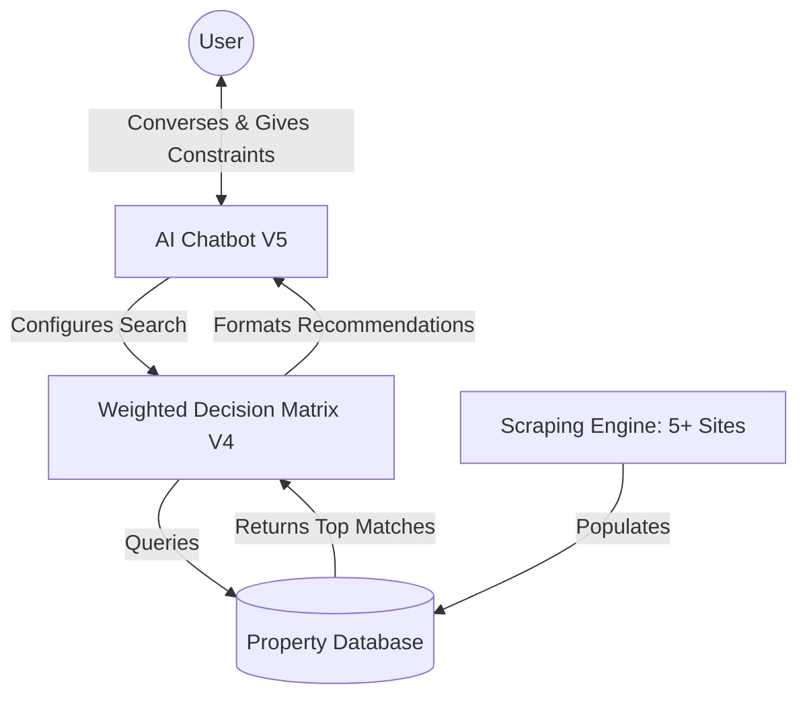

# 🏡 Real Estate Assistant Scraper

An intelligent real estate scraping assistant designed to simplify house hunting. It digs into the depths of the internet, searching through real estate platforms and social media groups to find properties that match specific user constraints (location, rent, connectivity, society, etc.).

## ✨ Current Capabilities (Version 1)
Our initial MVP focuses on laying the groundwork for automated property extraction:

*   **Multi-Site Orchestration:** A single python script (`multi_scraper.py`) designed to concurrently scrape multiple platforms.
*   **Headless Browser Automation:** Uses `playwright` and `playwright-stealth` to navigate dynamic JavaScript-heavy sites and evade basic bot detection.
*   **Targeted Extraction:** Successfully targets and extracts property data (Title, Rent, URL) from sites like **MagicBricks** for specific localities (e.g., NMIT / Yelahanka, Bangalore) within a set radius.
*   **Data Aggregation:** Aggregates scraped data and outputs it into structured JSON format (`v1_results.json`).

---

## 🚀 Product Roadmap & Future Versions

We are building this project in 5 distinct phases. We will evolve from a simple terminal script into a fully-fledged AI Chatbot that actively hunts for houses on your behalf.

### Version Comparison Table

| Feature / Milestone | V1 (Current) 🟢 | V2 🟡 | V3 🟡 | V4 🟡 | V5 (Final) 🔴 |
| :--- | :---: | :---: | :---: | :---: | :---: |
| **Core Scraping Script** | ✅ | ✅ | ✅ | ✅ | ✅ |
| **Data Output** | JSON File | Database | Database | Database | Database |
| **Supported Sites** | 1-2 Sites | 5+ Sites | 5+ Sites | 5+ Sites | All Web & Social |
| **User Interface (UI)** | Terminal | Terminal | **Web UI** | Web UI | Web UI |
| **Weighted Decision Matrix**| ❌ | ❌ | ❌ | **Yes (1-10 Scoring)** | Yes |
| **AI Assistant / Chatbot** | ❌ | ❌ | ❌ | ❌ | **Fully Integrated** |

---

## 🗺️ System Architecture Evolution

### V1 to V3: The Foundation & Visual Layer


### V4 to V5: The AI Assistant
In our final versions, the system will use a **Weighted Decision Matrix** where users score constraints (e.g. Travel: 9, Society: 8, Rent: 10) to rank properties. Finally, the **AI Chatbot** will act as the conversational interface for the entire engine.



## 🛠️ Getting Started
To run the current version of the scraper:

1. Install dependencies via `uv`:
   ```bash
   uv pip install playwright playwright-stealth
   uv run playwright install chromium
   ```
2. Run the multi-scraper script:
   ```bash
   uv run python multi_scraper.py
   ```
3. View the results in `v1_results.json`!
